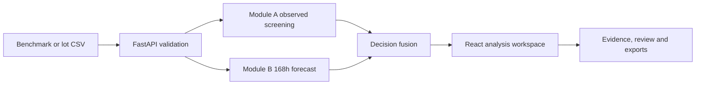

# BurnTrace

### Explainable, lot-aware semiconductor burn-in screening for SIH 26170

BurnTrace is a research prototype for **Smart India Hackathon 2026, Problem Statement 26170 (ISRO)**. It combines observed anomaly screening, early degradation forecasting and evidence-backed decision fusion in one React and FastAPI application.

[](https://sih26170-improved.onrender.com/)
[](#judge-walkthrough)
[](https://github.com/chaitanychoudhari3107-dotcom/SIH26170-Improved/actions/workflows/checks.yml)

> **Scope:** BurnTrace currently uses the supplied synthetic semiconductor benchmark. It supports research and prototype evaluation; it is not a production qualification system and does not claim zero false positives or zero false negatives.

## Evaluation evidence at a glance

- **1,343 components from 18 complete holdout lots**, separated by manufacturing lot rather than by individual rows.
- **Exact 24h and 168h confusion matrices**, including false negatives and healthy components sent for review.
- **Five frozen challenge lots** covering latent drift, late drift, benign baseline shifts and a defect-heavy peer baseline.
- **Part-level evidence** with observed measurements, 168h forecasts, lot context, reason codes and exportable review history.
- **Reproducible application checks** for benchmark regressions, protected access, CSV validation, lot analysis and evidence exports.

## Project links

| Resource | Link |
| --- | --- |
| Live prototype | [Open BurnTrace](https://sih26170-improved.onrender.com/) |
| Source code | [Browse this repository](https://github.com/chaitanychoudhari3107-dotcom/SIH26170-Improved) |
| Measured results | [Inspect the 24h and 168h review gates](https://sih26170-improved.onrender.com/models) |
| Architecture and lineage | [Inspect the analytical pipeline](https://sih26170-improved.onrender.com/system) |
| Technical documentation | [Open the documentation directory](docs/) |
| Runtime provenance | [Inspect the current runtime manifest](data/runtime/runtime_manifest.json) |
| Judge walkthrough | [Run the guided demonstration](#judge-walkthrough) |

## The problem

Semiconductor burn-in testing produces measurements at successive stress milestones such as 0h, 24h, 96h and 168h. Reviewers must distinguish an observed specification failure from a predicted future risk, understand why the system reached that conclusion and preserve the evidence used for the decision.

BurnTrace brings these tasks into a single workflow:

- **Module A** evaluates observed measurements at 0h, 24h, 96h and 168h.
- **Module B** uses 0h and 24h measurements to forecast behavior at 168h.
- **Decision fusion** separates observed rejection from forecast-based hold, monitoring and provisional-pass outcomes.
- **Evidence exports** preserve model inputs, verdicts, reason codes, artifact hashes and review history.

## Prototype snapshot

| Item | Current implementation |
| --- | --- |
| Benchmark | 1,343 holdout components across 18 whole lots |
| Measurement epochs | 0h, 24h, 96h and 168h |
| Frontend | React 19, React Router, Recharts and Vite |
| Backend | FastAPI, Python 3.12 and SQLite |
| Model serving | Frozen Module A artifact and rehearsal Module B artifact |
| Interfaces | Benchmark explorer, component analysis and lot-screening workspace |
| Access model | Public read-only mode with protected operational writes |
| Deployment | Docker image and Render blueprint included |

## What works

- Explore the frozen benchmark, its real observed epochs, forecasts and fused verdicts.
- Validate CSV files before import and commit complete imports atomically.
- Analyze complete lots with at least 30 components while preserving the original forecast across later runs.
- Distinguish observed `REJECT` results from forecast `HOLD`, `MONITOR` and early `PROVISIONAL_PASS` results.
- Preserve an observed historical specification breach as a rejection.
- Record append-only review decisions and export JSON evidence or CSV summaries.
- Protect write operations with an operator key while keeping the public demonstration read-only.
- Enforce request limits, bounded literal search, readiness checks and artifact/input hashing.

## System flow



The benchmark explorer and operational workspace remain separate. The former presents the frozen evaluation data; the latter accepts explicitly declared lot data for prototype screening.

## Judge walkthrough

### Public evaluator path

Open the [live BurnTrace prototype](https://sih26170-improved.onrender.com/) and select **Open public guided demo**. The walkthrough runs five synthetic cases through the backend decision path without a password or CSV upload.

1. Choose a case.
2. Inspect its 0h and 24h measurements.
3. Review the 168h forecast and fused verdict.
4. Reveal the retrospective observations to compare the forecast with later evidence.

The guided demo is read-only. It demonstrates the workflow and does not establish accuracy on real hardware.

### Protected operator path

The operator key unlocks CSV import, lot analysis, reviews and QA labels. Use the supplied 24h and 168h fixtures to rehearse the workflow; the blank templates contain headers only by design.

Do **not** publish an operator key in the presentation or repository. Anyone with that key can write to the associated workspace. If judges require operator access, use a disposable key on a separate demo instance with no valuable records and rotate it after judging.

For the complete import exercise:

1. Download the 24h synthetic fixture from the workspace.
2. Declare lot `DEMO_A`, variant `CMOS_A`, 78 expected components and measurements through 24h.
3. Validate and import the CSV.
4. Analyze the lot and inspect a component's measurements, forecast and reason codes.
5. Import the corresponding 168h fixture using the same lot declaration.
6. Analyze 168h, record a review and export the evidence.

Fixtures are renamed training examples. They verify the workflow but do not constitute model evaluation.

## Local setup

### Requirements

- Python 3.12
- Node.js 22

### Windows PowerShell

```powershell
python -m venv .venv
.venv\Scripts\Activate.ps1
pip install -r requirements-dev.txt

Set-Location frontend
npm ci
npm run build
Set-Location ..

python -m uvicorn backend.main:app --host 127.0.0.1 --port 8001
```

### macOS or Linux

```bash
python -m venv .venv
source .venv/bin/activate
pip install -r requirements-dev.txt

cd frontend
npm ci
npm run build
cd ..

python -m uvicorn backend.main:app --host 127.0.0.1 --port 8001
```

Open [http://127.0.0.1:8001](http://127.0.0.1:8001). For frontend development, run `npm run dev` inside `frontend`; Vite proxies `/api` requests to port 8001.

The verified runtime artifacts are included, so rebuilding them is unnecessary. `python scripts/build_runtime.py` reproduces the rehearsal Module B fit from archived sources, changes the runtime artifact and therefore requires fresh validation.

## Enable protected operational work

Set the variables before starting the backend. Choose a long random key, never commit it and never expose it through a `VITE_` variable.

PowerShell:

```powershell
$env:SIH26170_OPERATOR_KEY="your-long-random-secret"
$env:SIH26170_DATABASE_PATH="C:\sih-data\operational.db"
python -m uvicorn backend.main:app --host 127.0.0.1 --port 8001
```

Bash:

```bash
export SIH26170_OPERATOR_KEY='your-long-random-secret'
export SIH26170_DATABASE_PATH='/absolute/persistent/path/operational.db'
python -m uvicorn backend.main:app --host 127.0.0.1 --port 8001
```

Open **Data / Lot screening workspace** and enter the key. The browser holds it in memory only; refreshing or locking the workspace clears access. Restarting the server with a new key revokes the old one.

`SIH26170_ENABLE_DEMO_WRITES=1` enables an unauthenticated local demonstration mode. Never enable it on an internet-facing instance. Without an operator key or this local flag, reads remain available and writes stay disabled.

## Repository structure

```text
SIH26170-Improved/
├── backend/       FastAPI routes, inference, fusion and tests
├── data/          Frozen benchmark, reference and runtime artifacts
├── docs/          System, data and deployment documentation
├── frontend/      React interface and public demo fixtures
├── scripts/       Runtime build and verification utilities
├── Dockerfile     Single-origin production image
└── render.yaml    Read-only Render deployment blueprint
```

## Verification

Backend tests:

```bash
PYTHONPATH=backend python -m unittest backend.test_integration backend.test_operational -v
```

PowerShell equivalent:

```powershell
$env:PYTHONPATH="backend"
python -m unittest backend.test_integration backend.test_operational -v
```

Frontend checks:

```bash
cd frontend
npm ci
npm run build
npm run lint
```

Tests cover benchmark regressions, protected access, validation rollback, import conflicts, incomplete lots, invalid data, 24h-to-168h analysis, immutable forecast reuse, reviews and exports. GitHub Actions runs the same checks for pushes and pull requests.

## Scientific and operational limits

- This is a research prototype using synthetic data, not a production qualification system.
- The delivered Module A artifact runs unchanged with the declared serving-lot manifest supplied at prediction time.
- Module A's rank cutoff (`0.9395405078597341`) and confirmed-breach score floor (`0.900`) are different quantities.
- The original fitted Module B artifact was unavailable. The operational artifact was rebuilt using only the delivered training and calibration partitions and carries `REHEARSAL` status.
- Historical Module B benchmark metrics belong to the original delivered predictions and do not validate the rebuilt runtime.
- Forecast bounds do not guarantee 95% coverage. See [`data/runtime/runtime_manifest.json`](data/runtime/runtime_manifest.json) for provenance.
- A forecast crossing a specification creates a `HOLD`; it is not an observed failure.
- Static limits apply only where supplied in [`Device_Specs.csv`](data/reference/Device_Specs.csv). Missing limits remain missing.
- Review approval neither certifies a component nor changes the model output.
- The shared operator credential does not identify individual reviewers.

## Deployment notes

The [`Dockerfile`](Dockerfile) builds the frontend and bundles the backend and model artifacts. [`render.yaml`](render.yaml) defines a read-only public service with `/api/health` as its readiness endpoint.

Operational imports require an operator key and persistent storage. Set `SIH26170_DATABASE_PATH` to a file on the mounted storage. The default SQLite database on ephemeral hosting does not survive instance replacement. The current design assumes one backend instance; a multi-instance deployment requires a server database and individual identity management.

Never publish secrets, operator keys, local databases, `node_modules` or `.venv` contents.

## Remaining work before production

- Obtain the original Module B artifact or independently validate the rebuilt model on untouched lots.
- Validate using real devices, production instrumentation and lot-disjoint data.
- Report precision, recall, false positives, false negatives and interval coverage by variant and lot.
- Replace the shared key with individual accounts and roles.
- Add audited measurement corrections, durable backups and deployment monitoring.
- Complete browser, device and load testing under an approved engineering release process.

## Documentation

The README, application behavior and [`runtime_manifest.json`](data/runtime/runtime_manifest.json) describe the current prototype. Some long-form documents record earlier implementation or temporary deployment states and should not override the current runtime evidence.

- [Prototype and system documentation](docs/SIH26170_Prototype_Documentation.md)
- [Deployment and architecture guide](docs/SIH26170_Deployment_and_Architecture_Guide.md)
- [File and data documentation](docs/SIH26170_File_and_Data_Documentation.md)
- [Implementation walkthrough](docs/walkthrough.md)

---

Built for **Smart India Hackathon 2026 — Problem Statement 26170**.
