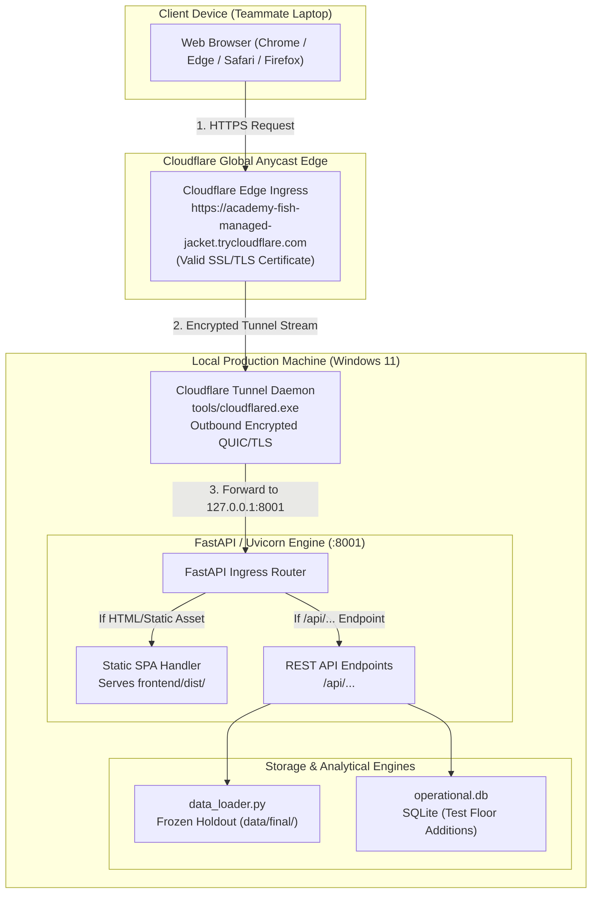

# SIH26170 — Deployment and Architecture Guide
## Live Public Demonstration, Cloudflare Tunnel Ingress, and Single-Origin Hosting

**Project Title**: SIH26170 Semiconductor Reliability Analysis Application  
**Author / Maintainer**: Anushka Gaikwad (`AnushkaGaikwad1707`)  
**Project Root**: `C:\Users\admin\Desktop\sih26170`  
**Date of Deployment**: September 23, 2026  
**Confidentiality & Isolation**: STRICT SIH26170 SCOPE ONLY (Completely isolated from the external Information Environment project)

---

## 1. Executive Summary & Purpose

To enable teammates, evaluators, and stakeholders to experience the **SIH26170 Semiconductor Reliability Analysis Application** from any laptop or browser without requiring local software installations, Python environments, Node.js packages, or network configuration, the application was packaged into a production-grade **Single-Origin Web Application** and published over a live, encrypted public HTTPS URL.

### Key Objectives Achieved:
1. **Zero Localhost Dependency**: Remote browsers connect over HTTPS and communicate with the backend via relative single-origin API routes (`/api/...`), completely avoiding mixed-content blocks and cross-origin CORS barriers.
2. **Real Analytics & No Mock Data**: The live deployment runs the actual FastAPI analytical core, loading the authoritative holdout partition `SIH26170-FINAL-01` (1,343 parts, 18 lots), Module A screening metrics, Module B prognostic models, and Decision Fusion logic.
3. **Encrypted Edge Routing**: Uses Cloudflare's secure tunnel infrastructure to establish an outbound TLS connection, eliminating the need to expose ports or configure firewalls.
4. **Private Version Control**: All source code, manifests, and documentation are committed and pushed to a secure, private GitHub repository (`SIH26170_final`).

---

## 2. Master Link Directory

All essential deployment, API, source code, and administrative links are listed below:

| Resource Description | Target / URL | Access / Role |
| :--- | :--- | :--- |
| **Live Application Demo (Root)** | [https://academy-fish-managed-jacket.trycloudflare.com](https://academy-fish-managed-jacket.trycloudflare.com) | Public HTTPS (Any Laptop / Browser) |
| **Interactive Diagnostic Deep-Dive** | [https://academy-fish-managed-jacket.trycloudflare.com/analyze/C00158](https://academy-fish-managed-jacket.trycloudflare.com/analyze/C00158) | Public HTTPS (Component C00158 Analysis) |
| **Fleet Summary API** | [https://academy-fish-managed-jacket.trycloudflare.com/api/analysis/summary](https://academy-fish-managed-jacket.trycloudflare.com/api/analysis/summary) | REST API (1,343 Parts Summary) |
| **Model Evaluation & D2 Proof API** | [https://academy-fish-managed-jacket.trycloudflare.com/api/models/evaluation](https://academy-fish-managed-jacket.trycloudflare.com/api/models/evaluation) | REST API (Confusion Matrix & Sensitivity) |
| **Fleet Production Lots API** | [https://academy-fish-managed-jacket.trycloudflare.com/api/lots](https://academy-fish-managed-jacket.trycloudflare.com/api/lots) | REST API (18 Production Lots) |
| **Device Specs Reference API** | [https://academy-fish-managed-jacket.trycloudflare.com/api/reference/specs](https://academy-fish-managed-jacket.trycloudflare.com/api/reference/specs) | REST API (18 Physical Specs Limits) |
| **Private GitHub Repository** | [https://github.com/AnushkaGaikwad1707/SIH26170_final](https://github.com/AnushkaGaikwad1707/SIH26170_final) | Private Codebase (Branch: `main`) |
| **GitHub Collaborator Settings** | [https://github.com/AnushkaGaikwad1707/SIH26170_final/settings/access](https://github.com/AnushkaGaikwad1707/SIH26170_final/settings/access) | Repository Access Management |

---

## 3. Deployment Tools & Technologies Used

The live deployment utilizes five core tools working in synergy:

### 1. Cloudflare Tunnel (`cloudflared`)
* **Tool Name**: Cloudflare Tunnel (CLI: `cloudflared-windows-amd64.exe`)
* **Local Location**: `C:\Users\admin\Desktop\sih26170\tools\cloudflared.exe` (Ignored from git)
* **What it does**: 
  - Establishes a lightweight, bidirectional encrypted tunnel between the local host machine and the nearest Cloudflare Edge PoP (Point of Presence).
  - Assigns a live, validly signed SSL/TLS domain name (`https://academy-fish-managed-jacket.trycloudflare.com`).
  - Completely circumvents NAT, private IP routing, carrier-grade NAT (CGNAT), and local Windows firewall restrictions.
  - Requires **zero inbound open ports** on the local router or firewall; communication is handled via persistent outbound HTTP/2 or QUIC connections.

### 2. FastAPI & Uvicorn (Single-Origin Server Core)
* **Tool Name**: FastAPI Framework + Uvicorn ASGI Server
* **Local Address**: `http://127.0.0.1:8001`
* **Role**:
  - Serves high-performance JSON REST endpoints (`/api/...`) utilizing pandas in-memory data structures.
  - Serves compiled production frontend assets (`/assets/...`) via FastAPI `StaticFiles`.
  - Implements a single-page application (SPA) fallback handler (`@app.get("/{full_path:path}")`) that routes client-side paths (e.g. `/analyze/C00158`, `/models`, `/components`) directly to `index.html`.
  - Configures `CORSMiddleware` with wildcard permissions to ensure API accessibility across all host configurations.

### 3. Vite 8 & React 19 (Frontend Production Compiler)
* **Tool Name**: Vite 8 Build Engine + React 19 SPA
* **Source Path**: `frontend/src/`
* **Compiled Distribution**: `frontend/dist/`
* **Optimization & Build**:
  - `npm run build` compiled 2,488 application modules into minified CSS (`index-D28HXss0.css`) and JavaScript bundles (`index-Qm_mnThB.js`) with zero compilation errors.
  - **Dynamic API Resolution**: Configured `frontend/src/services/api.js` to detect environment hostnames. When running under the production domain or tunnel, `BASE_URL` evaluates to an empty string (`''`), directing all API requests directly to the same origin (`/api/...`). This prevents remote client browsers from attempting to query `http://localhost:8001`.

### 4. Git & GitHub Enterprise / Cloud API
* **Tool Name**: Git CLI 2.47 + GitHub REST API v3
* **Repository**: `AnushkaGaikwad1707/SIH26170_final`
* **Role**:
  - Encrypted, auditable version control of the complete production codebase.
  - Configured strictly as a **Private** repository to protect proprietary semiconductor burn-in data and model weights.
  - Granular `.gitignore` filters out virtual environments, node modules, temporary binaries, and SQLite databases.

### 5. In-Memory Pandas Engine & SQLite WAL
* **Tool Name**: Pandas 2.2 + SQLite 3 (WAL Mode)
* **Role**:
  - `backend/data_loader.py` indexes all 1,343 component records and 18 lots into memory at boot time for sub-millisecond query responses.
  - `backend/operational/operational.db` maintains an isolated SQLite database for new test floor measurements, keeping test floor operations completely separate from frozen benchmark holdout data.

---

## 4. End-to-End Deployment Architecture



---

## 5. Step-by-Step Deployment Instructions

If you need to rebuild or restart the deployment on the host machine, follow these steps:

### Step 1: Build the Production Frontend
Open PowerShell in `C:\Users\admin\Desktop\sih26170\frontend` and execute:
```powershell
cd C:\Users\admin\Desktop\sih26170\frontend
cmd.exe /c npm run build
```
This generates the optimized production bundle in `C:\Users\admin\Desktop\sih26170\frontend\dist`.

### Step 2: Start the FastAPI Backend Server
Open PowerShell in `C:\Users\admin\Desktop\sih26170\backend` and launch Uvicorn on port `8001`:
```powershell
cd C:\Users\admin\Desktop\sih26170\backend
python -m uvicorn main:app --host 127.0.0.1 --port 8001
```
FastAPI will initialize `data_loader.py`, verify the holdout records (1,343 components), and bind static file routes.

### Step 3: Launch the Cloudflare Tunnel
Open another terminal and launch the Cloudflare Tunnel pointing to local port `8001`:
```powershell
cd C:\Users\admin\Desktop\sih26170
.\tools\cloudflared.exe tunnel --url http://127.0.0.1:8001
```
The output will provide the live tunnel URL (e.g., `https://academy-fish-managed-jacket.trycloudflare.com`).

---

## 6. Security, Isolation, and Teammate Access

### 1. Strict Isolation from External Projects
* The deployment operates entirely inside `C:\Users\admin\Desktop\sih26170`.
* No files or configurations from the external *Information Environment* project are bundled, referenced, or accessible.

### 2. Granting Teammate Access to the Private GitHub Repository
Because `SIH26170_final` is configured as **Private**, teammates cannot view the code until invited:
1. Navigate to: [https://github.com/AnushkaGaikwad1707/SIH26170_final/settings/access](https://github.com/AnushkaGaikwad1707/SIH26170_final/settings/access)
2. Click the green button: **"Add people"**.
3. Search for your teammates by GitHub username or email address.
4. Choose the appropriate permission level:
   - **Read**: Teammates can clone, pull, and view code, documentation, and datasets.
   - **Write**: Teammates can also push commits and create branches.
5. Confirm by clicking **"Add [username] to this repository"**.
